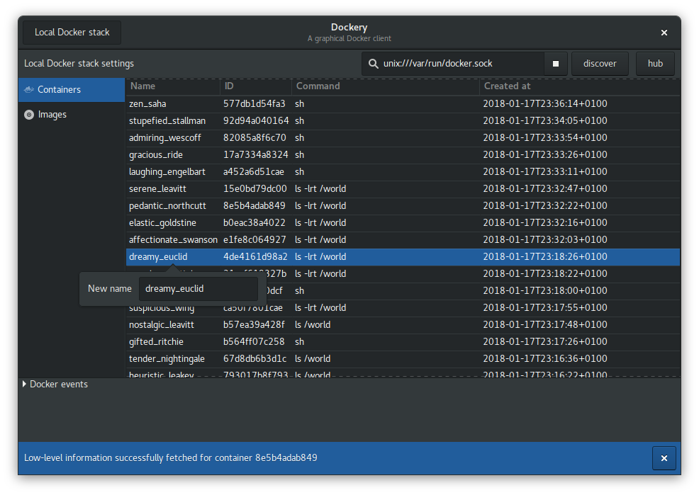
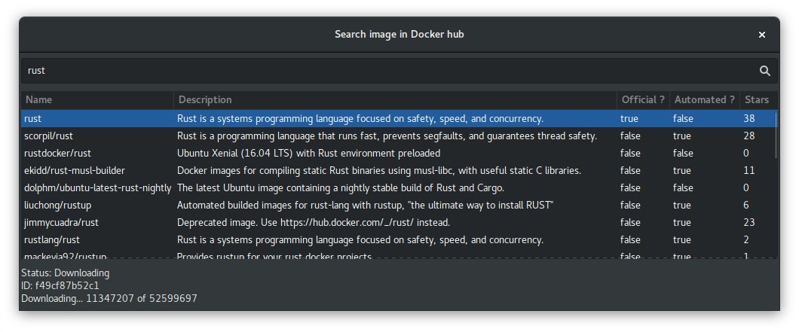
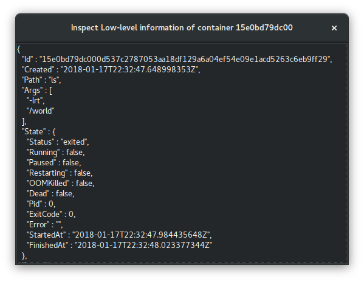

# Dockery

[](https://travis-ci.org/lcallarec/dockery)
[](https://codecov.io/gh/lcallarec/dockery)

**Dockery** is a _Docker_ GUI client written in *Vala*, targeted to be compiled on a GNU/Linux platform.

Until the project move the build system from plain _Makefile_ to _autotools_, the basic Makefile mainly targets **ubuntu/debian** based distributions.

## Features



* Connect to a local docker deamon via Unix Socket or TCP
 (autodiscover socket location)

* List all containers and execute some basic actions
  - update status (kill, pause, stop, start, restart)
  - rename 
  - inspect
  - destroy

* List all images, with basic informations

* List all created volumes

* Create a container from an image (with command overriding)

* Watch live Docker event stream

* Search & download images from Docker Hub

* Connect to a running container through a terminal

## Run with flatpak

* Install [flatpak](https://flatpak.org/)
* Build with `make flatpak-build`
* Run with `flatpak-builder --run flatpak/build org.lcallarec.Dockery.json ./dockery`

## Compile and install instructions

### Dependencies

| dependency | supported version range |
|---------|--------------------|
| valac   | *                  |
| libgtk-3-dev   | 3.14 - 3.32                |
| libgee-0.8-dev   | *                  |
| libjson-glib-dev   | 1.2 / 1.4                   |
| libsoup2.4-dev   | *                  |
| libvte-2.90-dev(*)   | *                  |
| libvte-2.91-dev(*)   | *                  |

*: only one of `libvte` package must be installed

### Install on debian-based environment

```bash
$ sudo apt-get valac install build-essential libgtk-3-dev libgee-0.8-dev libjson-glib-dev libsoup2.4-dev
```

Depending of your system, you must also install libvte version 2.90 or 2.91, **Dockery** can be compiled against both of them :

```bash
$ sudo apt-get install libvte-2.90-dev
$ # OR
$ sudo apt-get install libvte-2.91-dev
$ # (the later, the better)
```

### Compile and install :
```bash
$ make
$ sudo make install
```

## Execute

```
dockery
```

Alternativley, you can run Dockery using the dark theme variant :

```
dockery --dark-theme
```

# Contribute

Feel free to contribute quicker and better than I can :p Any contributions are welcome, don't be shy !

# More features ?

Feel free to ask any feature you'd like to have !

# More screenshots

|  |
|:---:|
| *Search and download image to docker public registry* |


|  |
|:---:|
| *Watch live docker daemon event stream* |


|  |
|:---:|
| *Container inspection* |
